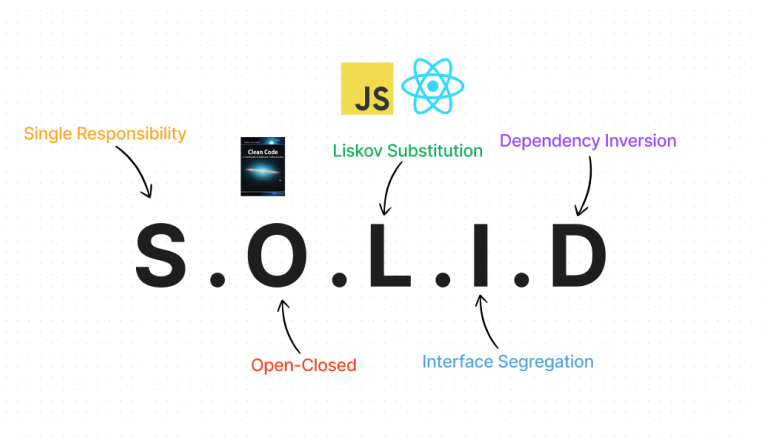

# Using S.O.L.I.D In React

[Video URL](https://www.youtube.com/watch?v=MSq_DCRxOxw)

## What is S.O.L.I.D?

- Single Responsibility Principle
- Open Closed Principle
- Liskov Substitution Principle
- Interface Segregation Principle
- Dependency Inversion Principle
